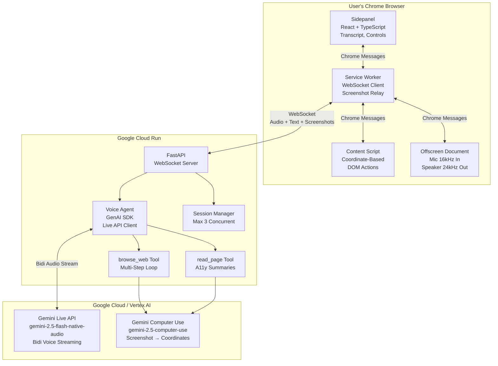

# AccessBrowse Architecture

## System Overview

AccessBrowse is a voice-controlled web browsing agent that enables users to navigate and interact with websites through natural language commands. The system uses Google's Gemini Live API for voice interaction and computer use capabilities to control the browser.

## Architecture Diagram

## Component Details

### Browser Extension (Frontend)

#### Sidepanel
- React + TypeScript UI component
- Displays conversation transcript
- Shows agent status and controls
- Manages user interactions

#### Service Worker
- Acts as WebSocket client
- Relays screenshots to backend
- Manages Chrome messaging with other components
- Handles connection lifecycle

#### Content Script
- Executes coordinate-based DOM actions
- Performs clicks, text input, and scrolling
- Communicates with Service Worker via Chrome messages

#### Offscreen Document
- Handles microphone input at 16kHz sample rate
- Outputs speaker audio at 24kHz
- Manages audio stream lifecycle

### Backend (Google Cloud Run)

#### FastAPI WebSocket Server
- Establishes bidirectional WebSocket connection with extension
- Manages message routing
- Handles session lifecycle

#### Voice Agent (GenAI SDK)
- Core orchestration logic
- Live API client for bidirectional voice streaming
- Manages tool invocations (browse_web, read_page)
- Processes Gemini responses

#### browse_web Tool
- Multi-step browser automation loop
- Delegates to Gemini Computer Use model
- Processes coordinate-based screenshots
- Manages interaction sequences

#### read_page Tool
- Extracts accessibility summaries
- Provides semantic page understanding
- Assists in content navigation

#### Session Manager
- Enforces maximum of 3 concurrent sessions
- Manages session state and cleanup
- Rate limiting and resource allocation

### Cloud Services

#### Gemini Live API
- Model: `gemini-2.5-flash-native-audio`
- Bidirectional voice streaming
- Real-time audio transcription
- Streaming text responses

#### Gemini Computer Use
- Model: `gemini-2.5-computer-use`
- Screenshot analysis
- Coordinate extraction for browser control
- Vision-based interaction

## Data Flow

1. **User Voice Input**: User speaks through microphone → Offscreen Document captures at 16kHz
2. **Audio Streaming**: Audio frames → Service Worker → WebSocket → Backend
3. **Agent Processing**: Voice Agent processes audio through Gemini Live API
4. **Visual Context**: Backend requests screenshots → Service Worker captures from tab
5. **Browser Control**: Gemini Computer Use returns coordinates → browse_web tool → Content Script executes
6. **Feedback**: Results and transcript → Sidepanel display + audio output through Speaker

## Key Design Patterns

- **Bidirectional Communication**: WebSocket enables real-time audio and screenshot exchange
- **Tool-Based Architecture**: browse_web and read_page tools decouple agent logic from browser control
- **Multi-Modal Input/Output**: Voice input and visual feedback for seamless user experience
- **Stateless Services**: Cloud Run backend can scale horizontally with session manager limiting concurrency
